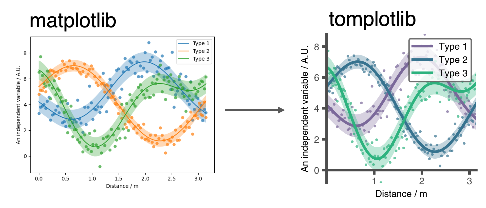
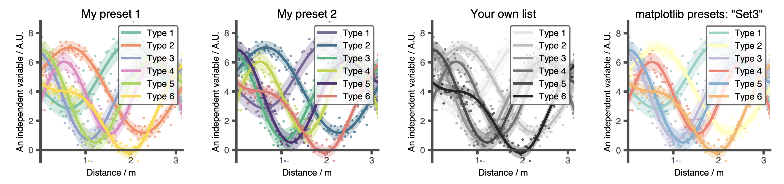

[](https://badge.fury.io/py/tomplotlib)


# tomplotlib

`tomplotlib` is Tom's wrapper for `matplotlib`. 
This package will style your plots and define some useful functions, including a function for automated saving of figures labelled by date and time. The main code is found in `./tomplotlib/tpl.py`



## Installation
To install, run
```
pip install tomplotlib
```
Alternatively, clone this directory and then run:
```
python setup.py install
```
(install in edit mode `pip install -e .` if you wish the edit the code.)

## Importing 
Import ```tomplotlib``` into your code with: /
```
import tomplotlib as tpl 
```
set's most of the required style parameters. 

## Usage

* ```tpl.save_figure(fig)```
This, in my opinion, is the most useful function. By defining a figure directory (```tpl.figure_directory = "where_to_save_my/Figures/"```), you can call ```tpl.save_figure(fig, `figureName`)``` on any `matplotlib` figure or animation object. This will timestamp the figure and save it in the figure directory (which will be made if it doesn't already exist), inside another directory which is the todays days date. By default images will be saved as `.png`s and `.svg`s, If an animation object if passed this will be saved as `'.gif'` and `'.mp4'`. 

```
import tomplotlib as tpl 
tpl.figure_directory = "./Figures/"
fig, ax = #some code which makes a maplotlib figure
tpl.save_figure(fig,"fig_name")
```


* ```tpl.xy_axes(ax)``` 
Tidies the axes, leaving only x and y axes at zero. 


* ```tpl.set_colorscheme(colorscheme)``` sets the colour scheme
```
tpl.set_colorscheme(colorscheme=1)
fig, ax = #some code which makes a matplotlib figure

tpl.set_colorscheme(colorscheme=2)
fig, ax = #some code which makes a matplotlib figure

tpl.set_colorscheme(colorscheme='Set3')
fig, ax = #some code which makes a matplotlib figure

tpl.set_colorscheme(colorscheme=[[0.9,0.9,0.9],[0.75,0.75,0.75],[0.6,0.6,0.6],[0.45,0.45,0.45],[0.3,0.3,0.3],[0.15,0.15,0.15],[0,0,0]])
fig, ax = #some code which makes a matplotlib figure
```
You pass ```colorscheme``` as an ```int``` (schemes I have defined), as ```str``` (matplotlib schemes, see [here](https://matplotlib.org/stable/tutorials/colors/colormaps.html)) or as a ```list``` of colors (e.g. list of hexstrings). These will become C0, C1, C2...




